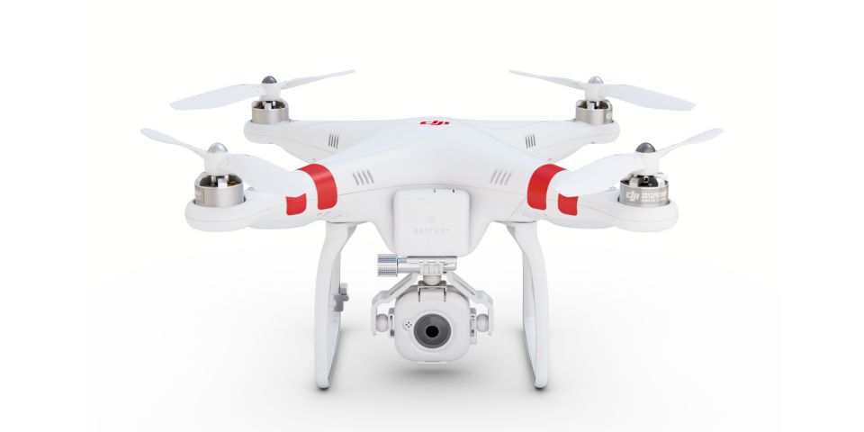

<!------------------------------------------------------------>
<!--              TetraTech - A Z-Pulley Talk 2015          -->
<!--              Target talk time - 60 min                 -->
<!------------------------------------------------------------>

<!------------------------------------------------------------>
<!-- Topic: Title slide -->

<h3>Geospatial "Show and Tell"</h3>

    <small>Aaron Racicot - <a href="mailto:aaronr@z-pulley.com">aaronr@z-pulley.com</a>
 
<a href="http://reprojected.com">reprojected.com</a> / <a href="http://twitter.com/reprojected">@reprojected</a> 
 
<a href="https://github.com/aaronr">github.com/aaronr</a>
  
<a href="http://aaronr.github.io/tetratech_2015">aaronr.github.io/tetratech_2015</a>
</small>

<!------------------------------------------------------------>
--SLIDE--
<!-- Topic: Introduce myself -->

<h1>Who I am?</h1>

<ul>
  <li><strong>SW Developer</strong></li>
  <li><strong>Environmental Scientist</strong></li>
  <li><strong>Open Source Advocate</strong></li>
</ul>

--SUBSLIDE--

  <h3>Computer Science</h3>
  <h2>Bridging the Gap</h2>
  <h3>Environmental Science</h3>

--SUBSLIDE--

<!------------------------------------------------------------>
--SLIDE--
<!-- Topic: Introduce not only NOAA, but ORR as well -->

<h2>Day Job - NOAA</h2>

--SUBSLIDE--

<h2>Fun Job - CUGOS</h2>

<!------------------------------------------------------------>
--SLIDE--
<!-- Topic: Data -->

<h2><b>Maps are layers</b></h2>

--SUBSLIDE--

<h1>Types of Data</h1>
<h2><b>Raster</b> and <b>Vector</b></h2>

--SUBSLIDE--

<h2><b>Raster</b> - Images</h2>

--SUBSLIDE--

<h2>"Mega Pixels"</h2>

<h3>4608 X 3456 = 15,925,248</h3>
<h3><b>16 million pixels!</b></h3>

--SUBSLIDE--

<h2><b>Vector</b> - Shapes</h2>

--SUBSLIDE--

<h2>Shapes, Shapes, Shapes</h2>

--SUBSLIDE--

<h2>Combine to <b>make</b> maps!</h2>

<!------------------------------------------------------------>
--SLIDE--
<!-- Topic: ERMA intro -->

<h2>The Deepwater Horizon experience</h2>

--SUBSLIDE--

<h1>Our project...</h1>

<ul style="list-style: none;">
  <li><h2>Environmental</h2></li>
  <li><h2>Response</h2></li>
  <li><h2>Management</h2></li>
  <li><h2>Application</h2></li>
</ul>

<!------------------------------------------------------------>
--SLIDE--
<!-- Topic: What is ERMA... user app, but complex system -->

<h2>What is ERMA?</h2>

<!------------------------------------------------------------>
--SLIDE--
<!-- Topic: DWH Stats -->

<h1>DWH - By the numbers</h1>

* 11 men perished
* 200+ million gallons of oil spilled
* 580+ miles of shoreline oiled
* 1.70+ million gallons dispersants applied
* 400+ controlled burns
* 4+ million feet of containment boom and 9+ million feet of sorbent boom

--SUBSLIDE--

--SUBSLIDE--

--SUBSLIDE--

--SUBSLIDE--

--SUBSLIDE--

<!------------------------------------------------------------>
--SLIDE--
<!-- Topic: ERMAs involvement with DWH -->

<h1>ERMA Shines as COP</h1>
<ul>
  <li><strong>Less than 48 hours to deploy</strong></li>
  <li><strong>Scalable – 1400+ response users, 16,000+ layers (DWH)</strong></li>
  <li><strong>45,000+ layers today</strong></li>
  <li><strong>Nimble – over 850 code commits in DWH first year</strong></li>
  <li><strong>Public ERMA – over 20 million hits in 24 hours!</strong></li>
</ul>

--SUBSLIDE--

<h2>Common Operational Picture (COP)</h2>

<!------------------------------------------------------------>
--SLIDE--
<!-- Topic: ERMA screenshots showing diverse capability -->

--SUBSLIDE--

--SUBSLIDE--

--SUBSLIDE--

--SUBSLIDE--

<!------------------------------------------------------------>
--SLIDE--
<!-- Topic: Big pushes forward -->

<h2>Continued push toward multi-agency</h2>
<h2>cooperation and data sharing</h2>

<h2>Scaling in new ways</h2>
<h2>(leveraging the cloud)</h2>

<!------------------------------------------------------------>
--SLIDE--
<!-- Topic: Loop around to the attendees... how does this matter? -->

<h2>So how/why does this matter to you?</h2>

--SUBSLIDE--

<h2>The nuts and bolts might not...</h2>
<h1>the philosophy does</h1>

--SUBSLIDE--

<h2>Focus on small teams of experts</h2>

--SUBSLIDE--

<h2>Leverage open tools,</h2>
<h2>but own the deployment</h2>
<ul>
  <li><strong>This gives us the benefit of a large community of developers</strong></li>
  <li><strong>This gives us the freedom modify and adapt when needed</strong></li>
</ul>

--SUBSLIDE--

<h2>Utilize open data</h2>
<h2>and open standards</h2>

--SUBSLIDE--

<h1>Doing more with less</h1>
<h2>(This is a good investment for NOAA)</h2>

<!------------------------------------------------------------>
--SLIDE--
<!-- Topic: How did we get here ... -->

Now the fun stuff!!!
<iframe width="640" height="480" src="https://sketchfab.com/models/6ea595564fcc4b82b372015c7a06e81b/embed" frameborder="0" allowfullscreen mozallowfullscreen="true" webkitallowfullscreen="true" onmousewheel=""></iframe>

--SUBSLIDE--

 
David Shean "Ice Man"
 
<small>http://psc.apl.washington.edu/wordpress/people/students/david-shean/</small>

--SUBSLIDE--

 
"Google Guys"

<!------------------------------------------------------------>
--SLIDE--
<!-- Topic: Hardware setup ... -->

Hardware options...

--SUBSLIDE--

 
Fully DIY

--SUBSLIDE--

 
Big Crazy Scary

--SUBSLIDE--

I choose low cost RTF (Ready To Fly) and then Hack It!

 
Phantom FC40 (~$450)

--SUBSLIDE--

 
Flytrex Data Logger (~$50)

--SUBSLIDE--

 
"The Rig"

--SUBSLIDE--

<iframe class="vine-embed" src="https://vine.co/v/OrBzvWi90mr/embed/simple" width="600" height="600" frameborder="0"></iframe>
 
Gimbal

<!------------------------------------------------------------>
--SLIDE--
<!-- Topic: Why is this so interesting now ... -->

 

$$$$$ Cheap $$$$$

Technology is easy to use

<h2>FUN!</h2>

<!------------------------------------------------------------>
--SLIDE--
<!-- Topic: Is it legal ... -->

<iframe width="100%" height="500px" frameBorder="0" src="https://www.mapbox.com/drone/no-fly/#10/45.4818/-122.6658"></iframe>
Where is it OK to fly
 
https://www.mapbox.com/drone/no-fly/

--SUBSLIDE--

<!------------------------------------------------------------>
--SLIDE--
<!-- Topic: Example  ... -->

--SUBSLIDE--

<iframe class="vine-embed" src="https://vine.co/v/OTeq2HmVx0n/embed/simple" width="600" height="600" frameborder="0"></iframe>
 
Video taken with my rig...

--SUBSLIDE--

<!------------------------------------------------------------>
--SLIDE--
<!-- Topic: Interesting workflows ... -->

Structure From Motion (SFM)

 
200 of these

--SUBSLIDE--

 
Load image batches

--SUBSLIDE--

 
Matching

--SUBSLIDE--

 
Visual SFM
 
Sparse Point Cloud

--SUBSLIDE--

 
AgiSoft
 
Sparse Point Cloud

--SUBSLIDE--

 
Dense Point Cloud

--SUBSLIDE--

 
Textured Mesh

<!------------------------------------------------------------>
--SLIDE--
<!-- Topic: Examples ... -->

<h2>More Examples</h2>

--SUBSLIDE--

 
Flying Brightwater Treatment Plant

--SUBSLIDE--

 
Flight Paths

--SUBSLIDE--

 
Photoscan SFM Rendering

<!------------------------------------------------------------>
--SLIDE--
<!-- Topic: Examples ... -->

 
Palouse Falls WA

--SUBSLIDE--

 
Example Image

--SUBSLIDE--

 
SFM Output

<!------------------------------------------------------------>
--SLIDE--
<!-- Topic: Examples ... -->

 
Grain Silo WA

--SUBSLIDE--

 
Example Image

--SUBSLIDE--

 
SFM Output

<!------------------------------------------------------------>
--SLIDE--
<!-- Topic: Examples ... -->

 
Chewy

--SUBSLIDE--

 
School

--SUBSLIDE--

 
Farm

--SUBSLIDE--

 
Compare (PhotoScan vs VSFM)

<!------------------------------------------------------------>
--SLIDE--
<!-- Topic: Interesting workflows ... -->

Panoramic image stitching

--SUBSLIDE--

 
... as good as Google gets

--SUBSLIDE--

 
AgiSoft

--SUBSLIDE--

<!------------------------------------------------------------>
--SLIDE--
<!-- Topic: Interesting workflows ... -->

OSM data creation / Web Maps

--SUBSLIDE--

 
QGIS Warper

--SUBSLIDE--

<pre><code>
gdal2tiles.py --profile=mercator -z 1-22 yourmap.tif outputfolder
</code></pre>

--SUBSLIDE--

http://langleywa.github.io/gisdata/tiles/langley-2nd-street-2014/21/335500/1368498.png
 

--SUBSLIDE--

 
Tiles into your App!

--SUBSLIDE--

 
Edit in OSM
http://ideditor.com/
https://www.openstreetmap.org/edit?editor=id#map=19/48.03979/-122.40668
<small>http://langleywa.github.io/gisdata/tiles/langley-2nd-street-2014-tms/{z}/{x}/{y}.png</small>

<!------------------------------------------------------------>
--SLIDE--
<!-- Topic: Future ... -->

<h2>The Future</h2>
Automation, DEM's, 3D printing, etc

--SUBSLIDE--

 
Automation (OpenDroneMap)

--SUBSLIDE--

 
OpenDroneMap working hard!

--SUBSLIDE--

 
DEM's

--SUBSLIDE--

 
3D Print Example (Chris Schmidt)

--SUBSLIDE--

 
Point Cloud

--SUBSLIDE--

 
Mesh

--SUBSLIDE--

 
Print Prep

--SUBSLIDE--

 
Print!

<!------------------------------------------------------------>
--SLIDE--
<!-- Topic: Wrapup -->
<h2>My Story</h2>

<h3>\* Develper turned Environmental Scientist \*</h3>
<h3>\* Many turn from Science to Development \*</h3>

<h2>Key is that we all meet in the middle!</h2>

--SUBSLIDE--

<h2>Open Source GIS is a</h2>
<h2>great path to bridge the gap</h2>

<!------------------------------------------------------------>
--SLIDE--
<!-- Topic: Thank You -->

<h1>Thank You !!!</h1>

